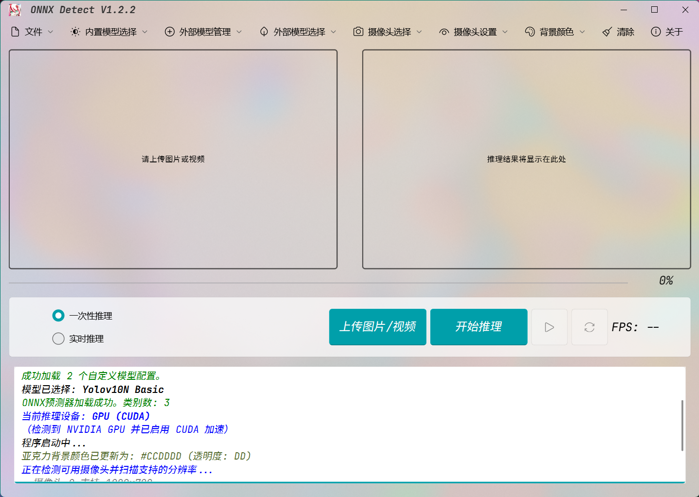

# ONNX Detect



这是一个基于 **PyQt6**、**QFluentWidgets** 和 **ONNXRuntime** 的现代化桌面应用程序，专为 YOLOv10 目标检测而设计。它提供了一个受 Fluent Design 启发的亚克力 (Acrylic) 界面，支持多种输入源、灵活的模型管理（内置与自定义）以及强大的摄像头控制功能。

---

## 🚀 核心功能

* **现代化UI界面**:
    * 使用 `PyQt6` 搭配 `pyqt6-fluent-widgets` 库构建，提供流畅的 Fluent Design (WinUI) 风格。
    * 支持 Windows 11 亚克力半透明背景效果，并允许用户自定义背景色调。
* **高性能推理后端**:
    * 采用 `onnxruntime-gpu` 作为核心推理引擎，优先使用 **NVIDIA GPU (CUDA)** 进行加速，并可无缝回退到 CPU。
    * 在 UI 中自动显示当前使用的推理设备 (GPU 或 CPU)。
* **灵活的推理模式**:
    * **单次推理 (One-Time)**:
        * 支持**图片文件**（如 .png, .jpg）。
        * 支持**视频文件**（如 .mp4, .avi），处理完成后可播放结果。
        * 支持**摄像头单帧捕捉**，可立即对当前摄像头画面进行一次性推理。
    * **实时推理 (Real-Time)**:
        * 支持**视频文件**输入，实时处理并在界面显示原始/推理双画面。
        * 支持**实时摄像头**输入，在显示摄像头画面的同时进行推理。
        * 实时推理过程中支持**暂停/恢复**。
* **强大的模型管理**:
    * **内置模型**: 自动加载 `models` 目录下的所有 YOLOv10 (n, s, m, l, x) onnx 模型。
    * **自定义模型**:
        * 支持通过 `custom_models/custom_models_config.yaml` 配置文件加载任意 ONNX 模型。
        * 完全支持自定义**类别名称 (Class Names)**。
        * 完全支持自定义**边界框颜色 (Colors)**。
        * 应用内提供打开模型目录、配置文件的快捷方式。
* **先进的摄像头控制**:
    * 自动检测并列出所有可用的系统摄像头。
    * 支持在 "启用/禁用" 摄像头系统和 "选择特定摄像头" 之间切换。
    * **分辨率设置**:
        * 自动检测每个摄像头支持的分辨率 (如 1080p, 720p, 480p)。
        * 允许用户在推理前为指定摄像头**预设分辨率**。
* **完善的文件处理**:
    * **完全支持中文（Unicode）路径**，无论是上传文件、保存结果还是加载模型。
    * 保存推理结果（图片）时，支持选择多种保存格式 (JPG, PNG, BMP, TIFF)。
    * 支持自定义设置和打开默认的保存目录。
* **结果播放与状态管理**:
    * 内置视频播放器，用于回放**视频推理结果**（并排显示原始视频与结果视频）。
    * 支持播放、暂停、重置（返回开头）视频。
    * 强大的应用状态机 (`ApplicationStateManager`)，可智能管理UI组件的启用/禁用状态，防止用户误操作（例如在推理时切换模式或在摄像头开启时上传文件）。
* **其他**:
    * 包含 "关于" 页面，显示版本和更新日志。
    * 包含 "清除" 功能，可一键重置应用状态并清空显示区域。
    * 包含一个神秘彩蛋。

---

## 📜 更新日志 (Changelog)

<details>
<summary>点击展开/折叠</summary>

<h3>版本更新日志</h3>
<p><b>V1.2.2 - 2025年10月31日</b></p>
<ul>
    <li>新增“摄像头设置”功能，可选摄像头分辨率。</li>
</ul>
<p><b>V1.2.1 - 2025年10月30日</b></p>
<ul>
    <li>新增 [神秘彩蛋]，由神秘数字触发。</li>
    <li>新增“关于”界面，显示更新日志。</li>
    <li>新增“清除”功能，允许清除输出预览</li>
    <li>全面支持中文路径的文件操作，保存推理结果时，图片文件提供多种格式。</li>
</ul>
<p><b>V1.2.0 - 2025年10月29日</b></p>
<ul>
    <li>代码结构重构，参考MVVM架构，集成高度抽象层。</li>
    <li>修复若干用户UI交互潜在BUG。</li>
</ul>
<p><b>V1.1.1 - 2025年10月28日</b></p>
<ul>
    <li>新增摄像头系统：支持检测、选择、启用/禁用摄像头。</li>
    <li>单次、实时推理模式支持摄像头作为输入源。</li>
    <li>优化UI状态管理，提升用户体验。</li>
</ul>
<p><b>V1.1.0 - 2025年10月27日</b></p>
<ul>
    <li>新增自定义模型加载、管理、配置功能。</li>
    <li>新增自主题颜色选择功能。</li>
</ul>
<p><b>V1.0.0 - 2025年10月26日</b></p>
<ul>
    <li>初始发行版，解决onnx-runtime兼容性导致pyinstaller无法正常打包exe问题。</li>
    <li>使用PyQT6-fluent-widgets第三方库进行UI美化。</li>
    <li>支持win11下亚克力界面效果。</li>
</ul>
<p><b>V0.0.0 - 2025年10月26日</b></p>
<ul>
    <li>初始版本，支持单个YOLOv10 ONNX 模型加载与推理。</li>
    <li>提供单次图片/视频推理与实时视频推理功能。</li>
    <li>QT标准UI。</li>
</ul>
<p><b>GitHub: </b><a href="https://github.com/STAR-REIN/remote-repo">点击访问</a></p>

</details>

---

## 🛠️ 安装与运行

### 选项 1: (推荐) 使用打包的 .exe 文件

1.  从本仓库的 [Releases](https://github.com/STAR-REIN/remote-repo/releases) 页面下载最新的 `.exe` 可执行文件的压缩包。
2.  压缩包版本说明：
   * 无后缀：完整版本，压缩包大小1.5G左右；自带CUDA和onnx-runtime-gpu环境，只需电脑自带支持CUDA 12.x.x的GPU即可使用GPU推理，建议无CUDA环境，有GPU用户安装该版本。
   * Lite_GPU：简化版本，压缩包大小1G左右；保留GPU支持，但需用户自行安装CUDA环境，建议有CUDA环境用户安装该版本。
   * Lite_CPU:简化版本，压缩包大小600M左右；去除GPU支持，仅支持CPU推理，建议无GPU用户安装该版本。
3.  确保您的 `models` 文件夹和（可选的）`custom_models` 文件夹与 `.exe` 文件位于同一目录下。
4.  直接运行 `.exe` 文件。

### 选项 2: 从源代码运行

1.  **克隆仓库**:
    ```bash
    git clone [https://github.com/STAR-REIN/ONNX-Detect.git](https://github.com/STAR-REIN/ONNX-Detect.git)
    cd ONNX-Detect
    ```

2.  **创建 Conda 环境**:
    本项目使用 `environment.yml` 文件来管理依赖。
    ```bash
    conda env create -f environment.yml
    ```
   

3.  **激活环境**:
    ```bash
    conda activate pyqt6_package
    ```
   

4.  **准备模型**:
    * 将您下载的 YOLOv10 `basic` 和 `enhance` ONNX 模型文件放入根目录下的 `models` 文件夹中。
    * （可选）根据下一节的说明配置 `custom_models` 文件夹。

5.  **运行程序**:
    ```bash
    python main.py
    ```
   

**依赖说明**:
* 本项目需要 **Python 3.12.1**。
* GPU 加速依赖 `onnxruntime-gpu==1.19.0`。请确保您的 **NVIDIA 驱动** 和 **CUDA Toolkit** 版本与 ONNXRuntime 兼容。如果您的 GPU 不受支持，`onnxruntime-gpu` 会自动回退到 CPU 模式。

---

## 📖 使用指南

1.  **启动程序**: 运行 `.exe` 或 `python main.py`。
2.  **选择模型**:
    * **内置模型**: 点击 "内置模型选择"，从下拉菜单中选择一个模型。程序会自动加载。
    * **自定义模型**: 点击 "外部模型管理" -> "加载自定义模型" 来加载您的 YAML 配置。然后点击 "外部模型选择" 来选用。
3.  **选择推理模式**:
    * **单次模式 (OneTime)**: 用于处理单个文件或单帧。
    * **实时模式 (RunTime)**: 用于处理视频文件或实时摄像头流。
4.  **选择输入源**:
    * **文件**: 点击 "上传文件" 按钮，选择图片或视频。上传后将显示预览。
    * **摄像头**:
        1.  （可选）点击 "摄像头设置" 按钮。在**禁用摄像头系统**的状态下，为您要使用的摄像头预选一个分辨率。
        2.  点击 "摄像头选择" -> "启用/禁用 ✕" 来启动摄像头系统。
        3.  再次点击 "摄像头选择"，从列表中选择一个检测到的摄像头（如 "摄像头 0"）。
        4.  此时输入预览区将显示实时摄像头画面。
5.  **开始推理**:
    * 点击 "开始推理" (或 "开始实时推理") 按钮。
    * 在推理过程中，按钮会变为 "停止推理"。
    * 实时推理模式下，"播放/暂停" 按钮可用于暂停/恢复推理线程。
6.  **查看结果**:
    * **单次模式**: 结果将显示在右侧 "推理结果" 区域。如果是视频，处理完成后会自动加载播放器。
    * **实时模式**: 左右两侧将同时显示 "原始画面" 和 "推理结果"。
7.  **保存结果**: 推理完成后，点击 "文件" -> "保存推理结果"。

---

## ⚙️ 配置自定义模型

本工具的强大之处在于可以轻松加载您自己的 ONNX 模型。

1.  **创建目录**: 在 `.exe` 文件或 `main.py` 所在的根目录下，创建一个名为 `custom_models` 的文件夹。
2.  **放置文件**:
    * 将您的 `.onnx` 模型文件（例如 `my_model.onnx`）放入 `custom_models` 文件夹。
    * 在该文件夹中创建一个名为 `custom_models_config.yaml` 的配置文件。
3.  **编辑 `custom_models_config.yaml`**:
    应用启动时会自动创建该文件的模板 (`.template`)。您可以参考该模板进行编辑，格式如下：

    ```yaml
    # ==============================================================================
    # 自定义ONNX模型配置说明文件 (模板内容)
    # ... (说明文字) ...
    # ------------------------------------------------------------------------------
    # 示例配置:
    # ==============================================================================

    custom_models:
      - model_file: "my_custom_model_v1.onnx"  # 确保这个onnx文件在custom_models目录下
        menu_display_name: "我的自定义模型 - V1汽车行人"
        class_names: ["car", "person", "truck", "bus"]
        colors: ["#FF0000", "#00FF00", "#0000FF", "#FFFF00"] # 对应car, person, truck, bus的颜色

      - model_file: "another_custom_detector.onnx" # 另一个自定义模型
        menu_display_name: "另一个检测器 - 物体识别"
        class_names: ["bottle", "cup", "keyboard", "mouse", "laptop", "monitor"]
        colors:
          - "#E74C3C" # 红色
          - "#2ECC71" # 绿色
          - "#3498DB" # 蓝色
          - "#F1C40F" # 黄色
          - "#9B59B6" # 紫色
          - "#1ABC9C" # 青色
          # ... 更多颜色
    # ==============================================================================
    ```
   

4.  **加载模型**:
    * 启动应用程序。
    * 点击 "外部模型管理" -> "加载自定义模型"。
    * 程序将读取 `custom_models_config.yaml`，验证 `.onnx` 文件是否存在，并将所有有效模型添加到 "外部模型选择" 的下拉菜单中。

---

## 📄 许可证

本项目采用 [GPLv3 License](LICENSE)。

## 🙏 致谢

* [YOLOv10](https://github.com/THU-MIG/YOLOv10)
* [PyQt6](https://www.riverbankcomputing.com/software/pyqt/)
* [PyQt-Fluent-Widgets
](https://github.com/zhiyiYo/PyQt-Fluent-Widgets)
* [ONNXRuntime](https://github.com/microsoft/onnxruntime)
